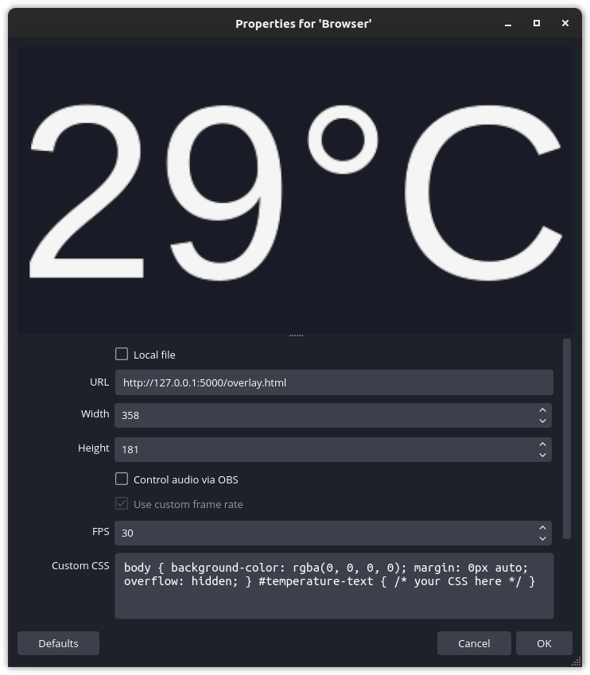

<!--
  Copyright (c) 2023 Michael Federczuk
  SPDX-License-Identifier: CC-BY-SA-4.0
-->

# usbtemp-server #

[version_shield]: https://img.shields.io/badge/version-0.1.0--indev01-informational.svg
[release_page]: https://github.com/mfederczuk/usbtemp-server/releases/tag/v0.1.0-indev01 "Release v0.1.0-indev01"
[![version: 0.1.0-indev01][version_shield]][release_page]
[](CHANGELOG.md "Changelog")

## About ##

**usbtemp-server** is a simple server application that reads the temperature from
a [DS18B20]-compatible, 1-Wire-connected USB thermometer and exposes that functionality as a HTTP JSON API.

This software is specifically written to support the thermometers sold by [usbtemp.com],
though — in theory — any DS18B20-compatible device should work. (this project is **not** sponsored by usbtemp.com)

It also serves a HTML page that continuously polls the server for the temperature and displays it.
(see section [HTML Polling Page](#html-polling-page))  
It's designed to be used an OBS Browser Source. (if you're a streamer, than this is what you're gonna be interested in)

> sub to [twitch.tv/helmahof]

[DS18B20]: <https://www.analog.com/en/products/ds18b20.html> "DS18B20 Datasheet and Product Info | Analog Devices"
[usbtemp.com]: <https://usbtemp.com> "Digital Thermometer −55 — +125°C with USB connection"
[twitch.tv/helmahof]: <https://twitch.tv/helmahof> "Helmahof - Twitch"

## Usage ##

The program takes no arguments.  
After executing it, the program will prompt for the port name of the USB thermometer to use.

```console
$ ./usbtemp-server
Enter the port name of the USB-thermometer: 
```

* On Linux-based systems, it will be one of `/dev/ttyUSB0`–`/dev/ttyUSB255`.  
  If no other USB serial devices are connected, it will be `/dev/ttyUSB0`. ([documentation])

* On Microsoft Windows, it will be one of `COM0`–`COM9`.  
  It will most likely be either `COM3` or `COM4`. Check the _Device Manager_ for the actual name.

  Example:

  ![A screenshot of the Windows 10 "Device Manager", showing that a USB thermometer, labeled "Prolific [CENSORED] USB Serial COM Port", is connected under the port name "COM3"](win10-device-manager-screenshot.png)

Entering nothing will abort the program.  
After entering a valid port name the program will display both the serial number of the USB thermometer and
the initially-read temperature in degree celsius.  
Immediately afterwards, the HTTP server will start. It will listen on port `5000`.

```console
$ ./usbtemp-server
Enter the port name of the USB-thermometer: [PORT NAME]

Serial number: [SERIAL NUMBER]
Initial temperature: [INITIAL TEMPERATURE]°C

info: Microsoft.Hosting.Lifetime[14]
      Now listening on: http://localhost:5000
info: Microsoft.Hosting.Lifetime[0]
      Application started. Press Ctrl+C to shut down.
info: Microsoft.Hosting.Lifetime[0]
      Hosting environment: Production
info: Microsoft.Hosting.Lifetime[0]
      Content root path: [PATH TO PARENT DIRECTORY OF THE EXECUTABLE FILE]
```

<!-- markdownlint-disable no-inline-html -->
To stop the server and the program itself, send an interrupt signal. (<kbd><kbd>Ctrl</kbd> + <kbd>C</kbd></kbd>)
<!-- markdownlint-enable no-inline-html -->

[documentation]: <https://www.kernel.org/doc/html/latest/usb/usb-serial.html> "USB serial &#8212; The Linux Kernel  documentation"

### JSON API ###

A `GET` request on the path `/temperature` will read the temperature from the configured USB thermometer.  
The response body JSON object has the following schema:

```typescript
{
	"degreeCelsius": number
}
```

As is obvious from the property name, the value of the property `"degreeCelsius"` is a decimal number representing
the temperature in degree celsius.  
Decimal point precisions is whatever the thermometer gives out.

### HTML Polling Page ###

The server also serves a static HTML page that continuously polls the server (using the JavaScript [Fetch API]) for
the temperature and displays it in degree celsius.  
The polling interval is 5 seconds.

At this point in time, neither the displayed unit nor the interval is configurable. (though it is on the ToDo list)

This page is available under the path `/overlay.html`.

[Fetch API]: <https://developer.mozilla.org/en-US/docs/Web/API/Fetch_API> "Fetch API - Web APIs | MDN"

#### Using the page as an OBS Browser Source ####

The HTML page is designed to be used in an OBS Browser Source.

Simply set the _"URL"_ field to either `http://127.0.0.1:5000/overlay.html` or `http://localhost:5000/overlay.html`.
Whichever you like more :)

If nothing is displayed, try reloading.

If you want the source to be as small as possible, the perfect size for it (if the CSS isn't modified) is 358x181.



## Download ##

Fully built and self-contained (you *don't* need .NET installed on your system) artifacts for
both Linux-based and Microsoft Windows systems (both for x86, 64-bit architecture) can be downloaded from
the [release page][release_page].

## Contributing ##

Read through the [Contribution Guidelines](CONTRIBUTING.md) if you want to contribute to this project.

## License ##

**usbtemp-server** is licensed under both the [**Mozilla Public License 2.0**](LICENSES/MPL-2.0.txt) AND
the [**Apache License 2.0**](LICENSES/Apache-2.0.txt).  
For more information about copying and licensing, see the [`COPYING.txt`](COPYING.txt) file.

_(note that this project is **not** affiliated with usbtemp.com)_
